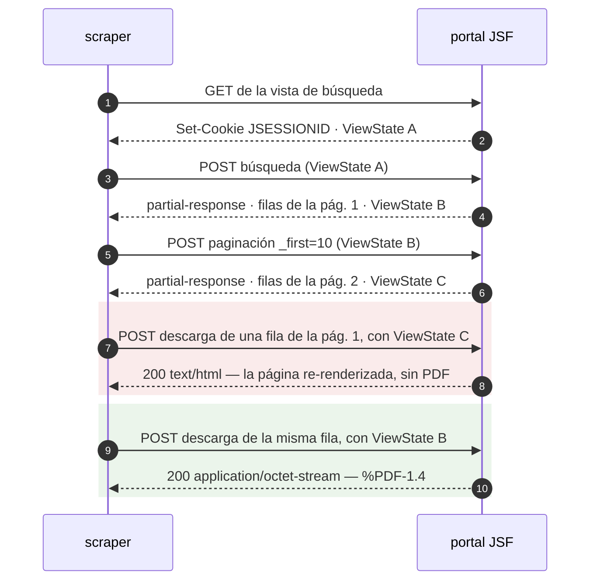
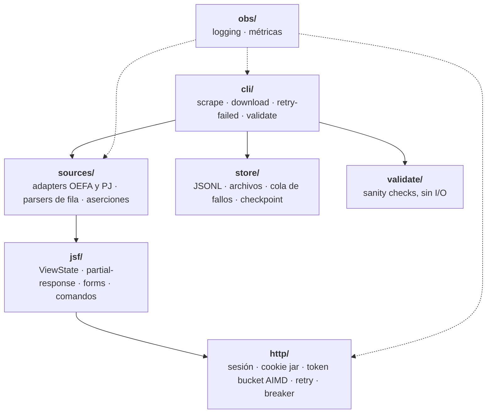

# Desafío de scraping — Jurisprudencia Nacional Sistematizada

[](https://github.com/AlehandroL/scrapper-challenge/actions/workflows/ci.yml)

Scraper en TypeScript, **sin automatización de navegador**, para portales que corren
JSF/Mojarra — un framework *stateful* donde la paginación y las descargas no son URLs sino
eventos POST contra un árbol de componentes que vive en el servidor.

Descubrir la estructura del sitio es parte explícita del enunciado, así que este repositorio
documenta el proceso: qué se observó, qué se dedujo, qué hipótesis se descartaron y cuáles
refutó la evidencia. El hilo completo está en la [bitácora](docs/bitacora.md).

## Qué produjo

| | |
|---|---|
| **Dataset** | [`data/oefa.jsonl`](data/oefa.jsonl) — 1.749 registros, de 1.753 filas recorridas en 176 páginas |
| **Documentos** | [`data/oefa.descargas.jsonl`](data/oefa.descargas.jsonl) — 30 PDFs, 232,6 MB, con tamaño y `sha256` |
| **Corrida del dataset** | 177 requests a 1 req/s, **cero 429 y cero reintentos**, ~6 min |
| **Suite** | 546 tests **sin red**, 2,5 s, contra Node 20, 22 y 24 en CI |
| **Sanity checks** | `npm run validate` — 25 chequeos, 0 errores y 2 avisos conocidos sobre lo entregado |

El sitio objetivo —`jurisprudencia.pj.gob.pe`— responde `403` desde Chile. Su adapter está
escrito y testeado contra markup real del portal, pero **no se ejercitó contra su fuente**, y
eso se declara acá y lo imprime el propio CLI antes de tocar la red. El detalle, en
[dos sitios](#dos-sitios-y-qué-se-corrió-contra-cada-uno) y en
[limitaciones conocidas](#limitaciones-conocidas).

## Cómo se corre

Requiere **Node ≥ 20**. No hay servicios que levantar ni credenciales que configurar.

```bash
npm ci
npm test                        # 546 tests, sin red, ~2,5 s
npm run typecheck
```

Contra el sitio de desarrollo, que tiene acceso abierto:

```bash
npm run scrape -- --hasta 3            # tres páginas a data/oefa.jsonl
npm run download -- --max-descargas 2  # dos PDFs a data/oefa/ — pesan ~9 MB cada uno
npm run validate                       # sanity checks sobre lo escrito, sin red
```

`scrape` es reanudable e idempotente: repetirlo completa lo que falte sin duplicar registros
ni volver a pedir páginas ya leídas. Sin `--hasta` recorre el dataset completo, 176 páginas.

Todos los comandos aceptan `--fuente oefa|pj` y `--help`. La
[referencia completa](#referencia) está más abajo.

## El problema: un sitio sin URLs

No existe `?page=2`. El portal corre **JSF/Mojarra**, donde el estado de la vista vive en el
servidor y cada interacción es un POST que lleva un token —el `ViewState`— identificando
contra qué versión del árbol de componentes se emite el evento. Replicarlo sin navegador es
el núcleo del desafío.



Los dos últimos pares no son un adorno: son un experimento controlado —misma sesión, misma
fila, mismos campos, variando solo el origen del token— y su resultado ordena la
arquitectura entera. **El `ViewState` de la descarga tiene que estar alineado con la página
donde vive la fila**, porque la fila se referencia por índice dentro del árbol de
componentes y ese índice solo significa lo correcto en el estado que corresponde.

La consecuencia es que **no se puede recolectar todo el metadata primero y descargar
después**: el downloader tiene que repaginar hasta la página de cada fila. Es lo que hace
`npm run download`, y por eso cada entrada de la cola de fallos anota su página.

Cuatro características más del protocolo, con lo que cada una obliga a hacer:

| Característica | Consecuencia |
|---|---|
| Estado por sesión en el servidor | Cookie `JSESSIONID` obligatoria y persistente. Sin ella la paginación devuelve `200` con la tabla vacía — no lanza, no avisa |
| Token rotativo | Una máquina de estados con un token vigente, actualizado en cada respuesta y en ningún otro lugar |
| Respuestas AJAX en XML | El HTML de las filas viaja dentro de bloques `CDATA`: dos pasadas de parsing, no una |
| Ids de componente autogenerados | `j_idt158` cambia entre deploys. Prohibido hardcodear: se descubren leyendo la página |

## Cómo se descubrió el protocolo

En orden, porque el orden es la parte que se puede reusar.

**1. El primer `curl` al sitio objetivo devolvió `403`.** Antes de asumir «es anti-bot y hace
falta un navegador», se hizo un diagnóstico por capas: DNS (`*.radwarecloud.net` — hay un WAF
adelante), TCP (conecta), TLS (1.3 completo, `Verify return code: 0`), y recién ahí HTTP. En
la capa de aplicación se probaron once headers de Chrome, `--http1.1`, un UA de Googlebot,
tres paths distintos y la raíz del host: `403` en todos.

**La prueba decisiva fue `curl-impersonate`.** Replica el Client Hello de Chrome cifrado por
cifrado, el `SETTINGS` frame de HTTP/2 y el orden de los headers: su huella JA3/JA4 es
indistinguible de un Chrome real. Recibir el mismo `403` con esa huella **descarta el
fingerprinting de cliente**. El WAF no evalúa *cómo* se conecta el cliente sino *desde
dónde*. Y `www.pj.gob.pe`, en el mismo `/24` de Radware, devuelve `302`: es una regla de la
aplicación protegida, no una política de red contra Chile.

Cinco minutos de diagnóstico que evitaron invertir en soluciones anti-bot para un problema
que no era anti-bot. La secuencia está en [`scripts/check-access.sh`](scripts/check-access.sh),
reutilizable contra cualquier fuente nueva.

**2. Separar el problema de acceso del problema de protocolo.** El 80 % del trabajo técnico
—`ViewState`, partial-response, paginación, descargas, rate limiting— es el mismo y no
requiere IP peruana. Bloquearse esperando resolver el acceso antes de empezar a programar es
el error de secuenciación más caro disponible. El enunciado ofrece un sitio alternativo sin
VPN «para desarrollo/pruebas», `publico.oefa.gob.pe`; verificar que corre el mismo framework
—Mojarra— confirmó que ese 80 % no depende del acceso, y el trabajo arrancó ahí el primer
día en vez de esperar a resolverlo.

**3. Replicar tres requests a mano antes de escribir una línea de código.** El GET inicial,
un POST de paginación y una descarga de PDF, con `curl`, hasta obtener respuestas idénticas
a las del navegador. Quedaron como fixtures versionados y como script reproducible:

```bash
bash scripts/capture-oefa.sh    # regenera los 8 fixtures contra el sitio vivo
```

Escribir el código después de eso convierte el reversing en traducción. Escribirlo antes
convierte cada bug en tres hipótesis simultáneas.

**4. Lo que la evidencia corrigió.** Cuatro supuestos razonables que el sitio refutó:

| Se asumía | Lo verificado |
|---|---|
| State saving server-side, con LRU de vistas | En OEFA es **client-side**: el token es un blob base64 de ~1,5 KB |
| Un solo `ViewState` vigente; el anterior muere al usarse | **Reutilizable** dentro de la sesión |
| El token vuelve con id `javax.faces.ViewState` | Vuelve como **`j_id1:javax.faces.ViewState:0`** — buscar por id exacto devuelve `undefined` contra toda respuesta real |
| La sesión caída llega como `ViewExpiredException` | Llega como **`<redirect>`** en 113 bytes, `HTTP 200`, sin `<error>` y sin que esa cadena aparezca en ninguna parte |

Los cuatro tienen el mismo síntoma cuando no se ven: cero filas, sin excepción, y la
sensación de que «el selector dejó de matchear». Es el modo de falla que ordena todo el
diseño de aserciones de este repositorio.

**5. Lo que solo aparece corriendo el dataset completo.** Los ocho fixtures cubren el
protocolo; los defectos de contenido aparecieron en las 1.753 filas. La corrida se detuvo en
el registro 37 (el portal publica resoluciones «Información confidencial», sin número y sin
enlace: registros legítimos sin documento) y después en el 277 (dos filas comparten
expediente, resolución **y documento**, y se distinguen por la unidad fiscalizable). Un
identificador que a veces falta y a veces se repite no es una clave, así que el registro pasó
a llevar un `id` derivado del contenido. Más tarde, el validador encontró 29 resoluciones sin
año por un regex demasiado estricto.

Las tres las encontraron aserciones duras. Escritas flojas desde el principio habrían costado
un dataset con registros faltantes y nadie enterándose.

**6. El sitio bloqueado tenía markup disponible en otra parte.** Durante seis bloques se dio
por hecho que del Poder Judicial no se podía obtener markup sin acceso a su red. Es falso: el
archivo web sirve los snapshots desde su propio dominio, y el `403` es una regla del WAF del
portal que no alcanza a un tercero que ya capturó las páginas.

```bash
bash scripts/capture-pj.sh      # tres snapshots reales a fixtures/pj/
```

Ese markup refutó cuatro supuestos sobre los que el adapter se iba a escribir —entre ellos
que el portal corriera PrimeFaces— y destapó un defecto en código ya escrito y ya testeado.
La lección de método es incómoda: **el diagnóstico del `403` fue tan concluyente que dejó de
buscarse.** Un diagnóstico correcto es una respuesta, no una clausura.

El detalle de cada hito, con los fixtures que lo demuestran, está en la
[bitácora](docs/bitacora.md), en [`fixtures/oefa/README.md`](fixtures/oefa/README.md) y en
[`fixtures/pj/README.md`](fixtures/pj/README.md).

## Dos sitios, y qué se corrió contra cada uno

| | Objetivo | Desarrollo |
|---|---|---|
| Host | `jurisprudencia.pj.gob.pe` | `publico.oefa.gob.pe` |
| Acceso | `403` desde Chile — Radware Cloud WAF | abierto |
| Framework | Mojarra (JSF 2.x) | Mojarra (JSF 2.x) |
| Componentes | **RichFaces 4.2.2.Final** | **PrimeFaces 6.0** |
| State saving | **server-side** (handle de dos longs) | **client-side** (blob base64 de ~1,5 KB) |
| Búsqueda | POST **no-ajax**: devuelve la página entera | evento AJAX: devuelve un `partial-response` |
| Estado del adapter | escrito y testeado, **no ejercitado contra su fuente** | ✅ dataset completo, descargas y validación |

Lo común es **Mojarra**, y es lo que transfirió: cinco de los seis archivos de `src/jsf/` se
reusaron enteros contra el segundo portal. El que no —`datatable.ts`, que es de PrimeFaces—
estaba aislado en un solo archivo desde el bloque 3, con un comentario que predecía
exactamente esto. Se tiró.

**Decisión de alcance, declarada:** no se contrató VPN ni proxy residencial para esta
entrega. El diagnóstico de acceso al Poder Judicial **queda abierto** —se sabe que el
discriminante es un atributo de la IP de origen, no cuál de los tres— y el adapter del PJ no
se ejercita contra su fuente. No se simula cobertura que no se logró.

Lo que sí se entrega es el cierre convertido en dos comandos, para quien tenga salida
peruana:

```bash
bash scripts/check-access.sh    # IP, país, ASN, el objetivo, el control del mismo /24, y la matriz de decisión
npm run smoke:pj                # ejercita el adapter entero contra el sitio vivo
```

`smoke:pj` separa las tres cosas que se confunden y tienen arreglos distintos: **bloqueo**
(`403` del WAF — no dice nada del adapter), **supuesto refutado** (llegamos y el markup no
calza, que es el desenlace más informativo) y **fallo de protocolo**. Desde Chile hoy
devuelve `2` y dice «BLOQUEADO», que es la respuesta correcta.

## Arquitectura



El criterio: **la capa `jsf/` no sabe nada de jurisprudencia ni de resoluciones ambientales,
y la capa `sources/` no sabe nada de reintentos ni de cookies.** Las flechas que no están son
tan importantes como las que sí: `http/` no menciona `ViewState`, `jsf/` no importa
`sources/`, y `validate/` no hace I/O —recibe los datos y devuelve hallazgos—.

Eso no es una promesa de este README: [`tests/architecture.test.ts`](tests/architecture.test.ts)
lo verifica en cada corrida, ignorando comentarios —citar el dominio para explicar *por qué*
es legítimo; depender de él, no—. Un criterio de diseño que solo vive en un README deja de ser
cierto en el tercer apuro.

Y la afirmación se puso a prueba desde afuera, que es lo que un test de grep no puede hacer:
contra un segundo portal con **otra librería de componentes y otro modelo de state saving**,
`view.ts`, `commands.ts`, `form.ts`, `view-state.ts` y `partial-response.ts` transfirieron
enteros; `datatable.ts` no transfirió nada. Cinco de seis, y el que no transfirió estaba
aislado en un solo archivo a propósito.

`obs/` no estaba en el plan original. Se agregó porque el logging y las métricas son
transversales —`sources/` y `store/` también emiten—, así que meterlos dentro de `http/`
habría obligado a sacarlos después.

## Referencia

### Comandos

| Comando | Red | Qué hace |
|---|---|---|
| `npm test` | no | La suite completa: 546 tests, ~2,5 s |
| `npm run typecheck` | no | `tsc --noEmit` |
| `npm run scrape` | sí | Recorre la fuente y escribe el dataset JSONL |
| `npm run download` | sí | Recorre y baja los documentos intercalado, con manifiesto y cola de fallos |
| `npm run retry-failed` | sí | Consume la cola: re-navega hasta la página de cada registro |
| `npm run validate` | opcional | Sanity checks sobre lo escrito; `--contra-el-sitio` agrega 2 requests |
| `npm run smoke:oefa` | sí | Transporte: `200`, `JSESSIONID` en el jar, token en el cuerpo |
| `npm run smoke:jsf` | sí | Protocolo: bootstrap → búsqueda → página 2, con el token rotando |
| `npm run smoke:source` | sí | El adapter contra las dos condiciones que los fixtures no cubren |
| `npm run smoke:download` | sí | La descarga, y el experimento del `ViewState` desalineado |
| `npm run smoke:pj` | sí | El adapter del Poder Judicial contra su sitio |
| `bash scripts/capture-oefa.sh` | sí | Regenera los fixtures de OEFA |
| `bash scripts/capture-pj.sh` | sí | Regenera los fixtures del PJ desde el archivo web |
| `bash scripts/check-access.sh` | sí | Diagnóstico de acceso al portal objetivo |

**Los cinco smokes quedan fuera de `npm test` a propósito.** La suite no debe depender de la
red ni golpear un sitio real en cada push: sería exactamente lo que el rate limiter existe
para evitar. CI corre `typecheck` + `test` contra Node 20, 22 y 24.

### Flags

Los cuatro CLIs aceptan `--fuente oefa|pj`, `--help` y, salvo `validate`, `--dry-run`.
Las rutas por defecto se derivan del nombre de la fuente.

| CLI | Flags propios |
|---|---|
| `scrape` | `--desde <n>` · `--hasta <n>` · `--salida <ruta>` · `--checkpoint <ruta>` · `--max-recuperaciones <n>` · `--reiniciar` |
| `download` | `--desde` · `--hasta` · `--destino <dir>` · `--manifiesto <ruta>` · `--dlq <ruta>` · `--checkpoint <ruta>` · `--max-descargas <n>` · `--reiniciar` |
| `retry-failed` | `--dlq` · `--destino` · `--manifiesto` · `--max-intentos <n>` |
| `validate` | `--dataset <ruta>` · `--manifiesto` · `--dlq` · `--descargas <dir>` · `--checkpoint` · `--page-size <n>` · `--total <n>` · `--hash` · `--contra-el-sitio` |

### Variables de entorno

Se validan con `zod` al arrancar ([`src/config.ts`](src/config.ts)) en vez de leerse sueltas:
un `HTTP_RPS=cinco` sin validar degrada el limiter a un `setTimeout(NaN)` y cuelga el scraper
sin decir por qué. Fallar al arrancar cuesta un segundo; fallar en la página 900, una corrida.

| Variable | Default | Para qué |
|---|---|---|
| `HTTP_RPS` | `1` | Tasa inicial del token bucket |
| `HTTP_MIN_RPS` / `HTTP_MAX_RPS` | `0.2` / `5` | Piso y techo del ajuste AIMD |
| `HTTP_BURST` | `2` | Tokens de ráfaga |
| `HTTP_TIMEOUT_MS` | `30000` | Timeout por request |
| `HTTP_MAX_RETRY_AFTER_MS` | `120000` | Tope al `Retry-After` del servidor: uno mal calculado —u hostil— colgaría la corrida una hora |
| `HTTP_USER_AGENT` | el de `capture-oefa.sh` | Cambiarlo introduce una variable no controlada al comparar contra los fixtures |
| `PROXY_URL` | — | Salida por proxy. **No ejercitado contra ningún proxy real** |
| `LOG_LEVEL` | `info` | `trace`…`silent` |
| `LOG_PRETTY` | según TTY | Formato legible en vez de JSON |

## Los datos

Se entregan dos JSONL —no un array JSON: un `[{…}, {…}]` monolítico obliga a mantener todo
en memoria y a escribir al final, y una caída en el registro 1.700 pierde la corrida entera—.

**Un registro** de [`data/oefa.jsonl`](data/oefa.jsonl):

```json
{
  "fuente": "oefa",
  "id": "e41f437005ce5c0fe1adb1ee",
  "indice": 0,
  "pagina": 1,
  "capturadoEn": "2026-08-15T19:58:24.469Z",
  "documentoUuid": "153a6d2a-cbed-40ef-b8ef-cd2272b19867",
  "expediente": "891-08-PRODUCE/DIGSECOVI-Dsvs",
  "administrados": ["Corporación del Mar S.A.", "Austral Group S.A.A."],
  "unidadFiscalizable": "Planta Playa Lado Norte Puerto Malabrigo",
  "sector": "Pesquería",
  "resolucion": "264-2012-OEFA/TFA",
  "anioResolucion": 2012
}
```

`id` es un hash del contenido, estable entre corridas. **No es el `documentoUuid`**, y esa
distinción costó dos corridas completas: hay 131 registros sin documento —el portal los marca
«Información confidencial»— y hay documentos que alcanzan a más de un registro. Tampoco sirve
`indice`, que es la posición dentro del resultado y se corre entera en cuanto el organismo
publica algo nuevo.

**Una entrada** del manifiesto [`data/oefa.descargas.jsonl`](data/oefa.descargas.jsonl):

```json
{
  "id": "e41f437005ce5c0fe1adb1ee",
  "fuente": "oefa",
  "documentoUuid": "153a6d2a-cbed-40ef-b8ef-cd2272b19867",
  "pagina": 1,
  "indice": 0,
  "archivo": "153a6d2a-cbed-40ef-b8ef-cd2272b19867_264-2012-oefa-tfa.pdf",
  "bytes": 9377728,
  "sha256": "3c175af6a0460268345a3ed1eaab69b0acaed0f100993204de444a11eb29ba14",
  "nombreServidor": "attachment;filename=\"RTFA N° 264-2012.pdf\"",
  "descargadoEn": "2026-08-14T21:07:42.879Z"
}
```

**Los binarios no se versionan** —los 30 PDFs pesan 232,6 MB— pero el manifiesto sí: es la
evidencia de qué se bajó, cuánto pesaba y con qué hash, y permite re-verificar los archivos
sin volver a pedirlos. `nombreServidor` se guarda como dato, no se usa: el
`content-disposition` real trae el filename en ISO-8859-1 (el byte `0xB0` de `N°`), leerlo
como UTF-8 produce mojibake, y además no garantiza unicidad. El nombre se construye desde
nuestro propio metadata.

## Cómo se valida

Los sanity checks son un comando, no un párrafo de este README:

```bash
npm run validate                        # dataset y manifiesto
npm run validate -- --hash              # además, re-lee cada archivo y recalcula su sha256
npm run validate -- --contra-el-sitio   # además, le pregunta el total al portal: 2 requests
```

Sobre los archivos entregados, con los PDFs al lado y preguntándole el total al portal:

```
Dataset — data/oefa.jsonl
  ✓ cobertura            1.749 presente(s) + 4 deduplicada(s) = 1.753, el total que el portal declara ahora
  ✓ anio-sin-parsear     los 1.618 registro(s) con documento tienen año de resolución
  ⚠ indices-ausentes     4 posición(es) sin registro entre 0 y 1752 · ej.: 294, 521, 522, 1026
Documentos — data/oefa.descargas.jsonl
  ✓ hash-distinto        30 archivo(s) con el sha256 que el manifiesto declara
Contra el sitio
  ✓ sitio-primera-pagina las 10 filas de la página 1 están en el dataset

  0 error(es) · 2 aviso(s) · 25 ok · 0 no evaluable(s)
```

**El nivel que importa es el cuarto: «no evaluable».** Un chequeo que no pudo correr no es un
chequeo que pasó. Si la carpeta de descargas no está —y en un clon limpio no está, porque los
binarios no se versionan— la integridad de los archivos se reporta `–` y nunca `✓`. Un informe
que dice «los 30 archivos están bien» sin haber abierto uno es peor que no tener informe,
porque además da confianza.

Lo mismo con la cobertura: sin un total declarado, el archivo solo prueba una **cota
inferior**, y una corrida cortada en la última página se ve idéntica a una completa. De ahí
sale `--contra-el-sitio`.

Hay además un test que corre este mismo informe sobre los archivos commiteados y exige cero
errores: tener sanity checks y haberlos corrido no son lo mismo, y con el test la diferencia
deja de depender de que alguien se acuerde.

> Los 30 PDFs de la corrida del bloque 5 quedaron localmente en `descargas/`, la ruta anterior
> a que hubiera dos fuentes. Para re-verificarlos: `npm run validate -- --descargas descargas --hash`.
> Una corrida nueva los escribe en `data/oefa/`, que es el default.

## Criterio → evidencia

| Criterio del enunciado | Dónde está |
|---|---|
| **Funcionalidad** | Corrida real con output commiteado: [`data/oefa.jsonl`](data/oefa.jsonl) (1.749 registros de 176 páginas) y 30 documentos con hash. Reproducible con `npm run scrape` |
| **Manejo de 429** | Token bucket con **AIMD** + **full jitter** + prioridad de `Retry-After` + circuit breaker global + cola de fallos + `npm run retry-failed`. Escrito a mano en [`src/http/`](src/http/) porque delegarlo a `bottleneck` escondería justo lo que se evalúa |
| **Código limpio** | Separación transporte / protocolo / dominio / persistencia, sostenida por [`tests/architecture.test.ts`](tests/architecture.test.ts) y puesta a prueba contra un segundo portal |
| **Robustez** | Recuperación de la vista caída en sus tres formas, validación de magic bytes del PDF, escritura atómica, checkpointing, y **diez condiciones de drift** que detienen la corrida antes de escribir datos vacíos |
| **Documentación** | Este README, la [bitácora](docs/bitacora.md) del proceso, y los README de [`fixtures/oefa/`](fixtures/oefa/README.md) y [`fixtures/pj/`](fixtures/pj/README.md) |

Sobre el drift, que es el criterio menos visible: el peor modo de falla de un scraper no es la
excepción, es seguir corriendo tres semanas escribiendo datos vacíos sin que nadie lo note.
Cada una de las diez condiciones tiene un test que la ve saltar —una aserción que nunca se vio
fallar es una aserción que no se sabe si funciona—. Los rótulos de las columnas, en cambio,
**avisan y no detienen**: cambian por una tilde sin que cambie nada más, y una aserción que
tumba la corrida por cosmética es una aserción que alguien va a desactivar.

## Limitaciones conocidas

Las cuatro, juntas y sin adornos.

**1. El adapter del Poder Judicial no se ejercitó contra su fuente.** El archivo web captura
GETs; en ese portal los resultados nacen de un POST, así que ningún snapshot trae filas ni
controles de paginación. Eso deja dos superficies de distinta calidad y mezclarlas sería la
cobertura simulada que este repositorio rechaza:

| Superficie | Estado |
|---|---|
| Ids del form, campos de búsqueda, state saving, los tres forms, forma del `onclick`, descubrimiento del botón «Buscar» | verificado contra markup real |
| Forma de las filas, comando de paginación, POST de descarga | **sin verificar** — escritos contra lo que documenta un scraper público de terceros |

El diseño se ordenó alrededor de esa asimetría con una regla: **lo que no se puede saber se
descubre; lo que no se puede descubrir se denuncia con nombre propio.** No hay un solo id de
componente hardcodeado, y cada fallo de descubrimiento es un error que nombra qué request hay
que capturar para cerrarlo. Cada fuente declara su estado de evidencia y **el CLI lo imprime
antes de tocar la red**.

**2. El diagnóstico de acceso queda abierto.** Se sabe qué *no* es el problema —ni
fingerprinting TLS/JA3, ni headers, ni huella HTTP/2, ni allowlist por UA— y que el
discriminante es un atributo de la IP de origen. No se sabe cuál de los tres: país, ASN o
reputación puntual. `check-access.sh` lo cierra en un comando desde una red con salida
peruana.

**3. No hay filtros.** El reversing se hizo con el formulario vacío, que devuelve el dataset
completo. Los cuatro filtros del portal se reenvían vacíos porque JSF exige el submit completo
del form, pero la búsqueda con valores no está reversada. La interfaz de fuente **se expone
sin parámetros de filtrado** en vez de aceptarlos y descartarlos en silencio: una firma que
promete lo que no hace es peor que una que no lo ofrece.

**4. El camino del proxy nunca corrió contra un proxy real.** `PROXY_URL` está implementado y
`https-proxy-agent` instalado, pero no se contrató ninguno para esta entrega. Se declara así en
vez de presentarse como funcionalidad probada. Cuando se use, la IP debe ser **fija durante
toda la vida de la sesión**: la rotación por request —default de los proveedores
residenciales— es incompatible con JSF, porque el `JSESSIONID` queda asociado a un nodo y
cambiar de IP provoca expiración inmediata.

## Bitácora

El proceso completo, bloque a bloque, está en **[`docs/bitacora.md`](docs/bitacora.md)**: qué
se descubrió en cada etapa, qué supuestos refutó el sitio y qué decisión salió de ahí.

| Bloque | Qué cerró |
|---|---|
| 1 | Reversing del protocolo en OEFA + diagnóstico de acceso al portal objetivo |
| 2 | Capa de transporte: cookie jar, token bucket AIMD, retry, circuit breaker |
| 3 | Capa JSF: `ViewState`, partial-response, serialización de forms, comandos |
| 4 | Adapter de OEFA, parsers de fila y persistencia JSONL |
| 5 | Descarga de documentos, cola de fallos y reanudación |
| 6 | Sanity checks sobre el dataset y los documentos entregados |
| 7 | Adapter del Poder Judicial, contra markup real recuperado del archivo web |
| 8 | Documentación de la entrega y separación de la bitácora |
