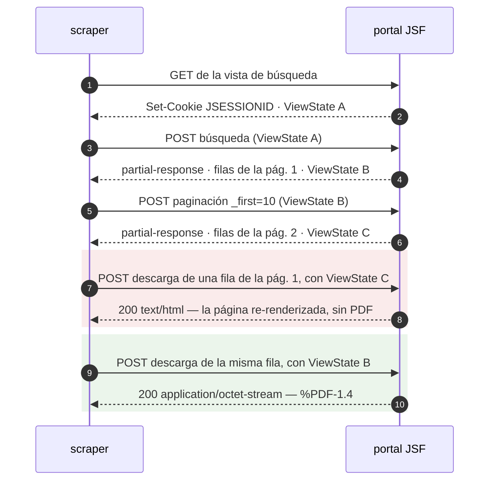
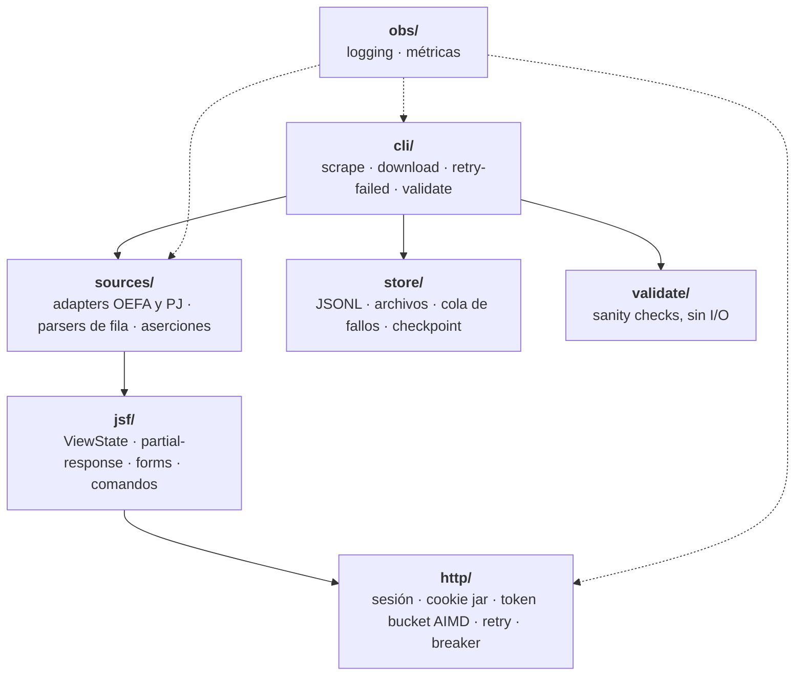

# El proceso: cómo se descubrió el protocolo

El enunciado dice que **descubrir la estructura del sitio es parte del desafío**, así que
este documento conserva el hilo: qué se observó, qué se dedujo, qué hipótesis se
descartaron y cuáles refutó la evidencia.

El [README](../README.md) es la entrega —qué hace, cómo se corre, qué produjo—. Esto es
cómo se llegó hasta ahí. El detalle bloque a bloque, con los fixtures que lo demuestran,
está en la [bitácora](bitacora.md).

> **Sobre el sitio.** El enunciado ofrece dos portales: `jurisprudencia.pj.gob.pe`, que
> exige VPN peruana, y `publico.oefa.gob.pe`, abierto. **Esta entrega toma OEFA como sitio
> principal** y no contrata VPN. El adapter del Poder Judicial existe y está testeado
> contra markup real, pero no se ejercitó contra su fuente; ver
> [limitaciones conocidas](../README.md#limitaciones-conocidas).

---

## El problema: un sitio sin URLs

No existe `?page=2`. El portal corre **JSF/Mojarra**, donde el estado de la vista vive en
el servidor y cada interacción es un POST que lleva un token —el `ViewState`—
identificando contra qué versión del árbol de componentes se emite el evento. Replicarlo
sin navegador es el núcleo del desafío.



Los dos últimos pares no son un adorno: son un experimento controlado —misma sesión, misma
fila, mismos campos, variando solo el origen del token— y su resultado ordena la
arquitectura entera. **El `ViewState` de la descarga tiene que estar alineado con la página
donde vive la fila**, porque la fila se referencia por índice dentro del árbol de
componentes y ese índice solo significa lo correcto en el estado que corresponde.

La consecuencia es que **no se puede recolectar todo el metadata primero y descargar
después**: el downloader tiene que repaginar hasta la página de cada fila. Es lo que hace
`npm run download`, y por eso cada entrada de la cola de fallos anota su página.

Cuatro características más del protocolo, con lo que cada una obliga a hacer:

| Característica | Consecuencia |
|---|---|
| Estado por sesión en el servidor | Cookie `JSESSIONID` obligatoria y persistente. Sin ella la paginación devuelve `200` con la tabla vacía — no lanza, no avisa |
| Token rotativo | Una máquina de estados con un token vigente, actualizado en cada respuesta y en ningún otro lugar |
| Respuestas AJAX en XML | El HTML de las filas viaja dentro de bloques `CDATA`: dos pasadas de parsing, no una |
| Ids de componente autogenerados | `j_idt158` cambia entre deploys. Prohibido hardcodear: se descubren leyendo la página |

---

## Cómo se descubrió, en orden

El orden es la parte que se puede reusar.

### 1. Replicar tres requests a mano antes de escribir una línea de código

El GET inicial, un POST de paginación y una descarga de PDF, con `curl`, hasta obtener
respuestas idénticas a las del navegador. Quedaron como fixtures versionados y como script
reproducible:

```bash
bash scripts/capture-oefa.sh    # regenera los 8 fixtures contra el sitio vivo
```

Escribir el código después de eso convierte el reversing en traducción. Escribirlo antes
convierte cada bug en tres hipótesis simultáneas.

### 2. Lo que la evidencia corrigió

Cuatro supuestos razonables que el sitio refutó:

| Se asumía | Lo verificado |
|---|---|
| State saving server-side, con LRU de vistas | En OEFA es **client-side**: el token es un blob base64 de ~1,5 KB |
| Un solo `ViewState` vigente; el anterior muere al usarse | **Reutilizable** dentro de la sesión |
| El token vuelve con id `javax.faces.ViewState` | Vuelve como **`j_id1:javax.faces.ViewState:0`** — buscar por id exacto devuelve `undefined` contra toda respuesta real |
| La sesión caída llega como `ViewExpiredException` | Llega como **`<redirect>`** en 113 bytes, `HTTP 200`, sin `<error>` y sin que esa cadena aparezca en ninguna parte |

Los cuatro tienen el mismo síntoma cuando no se ven: cero filas, sin excepción, y la
sensación de que «el selector dejó de matchear». Es el modo de falla que ordena todo el
diseño de aserciones de este repositorio.

### 3. Lo que solo aparece corriendo el dataset completo

Los ocho fixtures cubren el protocolo; los defectos de contenido aparecieron en las 1.753
filas. La corrida se detuvo en el registro 37 (el portal publica resoluciones «Información
confidencial», sin número y sin enlace: registros legítimos sin documento) y después en el
277 (dos filas comparten expediente, resolución **y documento**, y se distinguen por la
unidad fiscalizable). Un identificador que a veces falta y a veces se repite no es una
clave, así que el registro pasó a llevar un `id` derivado del contenido. Más tarde, el
validador encontró 29 resoluciones sin año por un regex demasiado estricto.

Las tres las encontraron aserciones duras. Escritas flojas desde el principio habrían
costado un dataset con registros faltantes y nadie enterándose.

---

## Arquitectura



El criterio: **la capa `jsf/` no sabe nada de resoluciones ambientales ni de
jurisprudencia, y la capa `sources/` no sabe nada de reintentos ni de cookies.** Las
flechas que no están son tan importantes como las que sí: `http/` no menciona `ViewState`,
`jsf/` no importa `sources/`, y `validate/` no hace I/O —recibe los datos y devuelve
hallazgos—.

Eso no es una promesa: [`tests/architecture.test.ts`](../tests/architecture.test.ts) lo
verifica en cada corrida, ignorando comentarios —citar el dominio para explicar *por qué*
es legítimo; depender de él, no—. Un criterio de diseño que solo vive en un README deja de
ser cierto en el tercer apuro.

Y la afirmación se puso a prueba desde afuera, que es lo que un test de grep no puede
hacer: contra un segundo portal con **otra librería de componentes y otro modelo de state
saving**, `view.ts`, `commands.ts`, `form.ts`, `view-state.ts` y `partial-response.ts`
transfirieron enteros; `datatable.ts` no transfirió nada. Cinco de seis, y el que no
transfirió estaba aislado en un solo archivo a propósito.

`obs/` no estaba en el plan original. Se agregó porque el logging y las métricas son
transversales —`sources/` y `store/` también emiten—, así que meterlos dentro de `http/`
habría obligado a sacarlos después.

---

## Aserciones y drift

El peor modo de falla de un scraper no es la excepción: es seguir corriendo tres semanas
escribiendo datos vacíos sin que nadie lo note. De ahí salen **diez condiciones de drift**
que detienen la corrida antes de escribir. Cada una tiene un test que la ve saltar — una
aserción que nunca se vio fallar es una aserción que no se sabe si funciona.

Los rótulos de las columnas, en cambio, **avisan y no detienen**: cambian por una tilde sin
que cambie nada más, y una aserción que tumba la corrida por cosmética es una aserción que
alguien va a desactivar.

El reparto error/aviso está en [`src/sources/aserciones.ts`](../src/sources/aserciones.ts),
y cada lado se ganó su lugar: la aserción de filas repetidas nació dura y la página 28 del
sitio real la rompió con dos filas perfectamente legítimas. Una aserción que se relaja
después de romper una corrida real es peor que la que nació blanda: enseña a desconfiar de
todas.

---

## El segundo portal, y por qué no se ejercitó

El enunciado ofrece `jurisprudencia.pj.gob.pe` como sitio que exige VPN peruana. Se escribió
su adapter igual, y el ejercicio valió por sí mismo: es lo que puso a prueba la separación
de capas contra un portal con otra librería de componentes.

| | Principal | Secundario |
|---|---|---|
| Host | `publico.oefa.gob.pe` | `jurisprudencia.pj.gob.pe` |
| Acceso | abierto | `403` sin salida peruana — Radware Cloud WAF |
| Framework | Mojarra (JSF 2.x) | Mojarra (JSF 2.x) |
| Componentes | **PrimeFaces 6.0** | **RichFaces 4.2.2.Final** |
| State saving | **client-side** (blob base64 de ~1,5 KB) | **server-side** (handle de dos longs) |
| Búsqueda | evento AJAX: devuelve un `partial-response` | POST **no-ajax**: devuelve la página entera |
| Estado del adapter | ✅ dataset completo, descargas y validación | escrito y testeado, **no ejercitado contra su fuente** |

### El diagnóstico de acceso, y lo que enseñó

El primer `curl` al portal del Poder Judicial devolvió `403`. Antes de asumir «es anti-bot
y hace falta un navegador», se hizo un diagnóstico por capas: DNS (`*.radwarecloud.net` —
hay un WAF adelante), TCP (conecta), TLS (1.3 completo, `Verify return code: 0`), y recién
ahí HTTP. En la capa de aplicación se probaron once headers de Chrome, `--http1.1`, un UA
de Googlebot, tres paths distintos y la raíz del host: `403` en todos.

**La prueba decisiva fue `curl-impersonate`.** Replica el Client Hello de Chrome cifrado
por cifrado, el `SETTINGS` frame de HTTP/2 y el orden de los headers: su huella JA3/JA4 es
indistinguible de un Chrome real. Recibir el mismo `403` con esa huella **descarta el
fingerprinting de cliente**. El WAF no evalúa *cómo* se conecta el cliente sino *desde
dónde*.

Cinco minutos de diagnóstico que evitaron invertir en soluciones anti-bot para un problema
que no era anti-bot. La secuencia está en
[`scripts/check-access.sh`](../scripts/check-access.sh), reutilizable contra cualquier
fuente nueva.

**Falta una cuarta capa, y se agregó después de necesitarla.** Las tres primeras miran el
problema desde un único punto de vista: el propio. Eso alcanza para leer un `403` —llegaste
y te rechazaron— pero no para leer un `ECONNREFUSED`, porque «me bloquearon a mí» y «está
caído para todos» producen el mismo síntoma desde una sola red. La cuarta capa varía el
origen sin cambiarse de red: le pide a nodos de terceros repartidos por el mundo que
intenten el mismo TCP, y **sondea junto a cada objetivo un control que se espera que
conecte**. Sin ese control el sondeo miente en silencio, porque «nadie llega» es también lo
que se ve cuando el que está roto es el servicio de terceros.

Lo que hizo falta para escribirla: el 17 de agosto de 2026 `publico.oefa.gob.pe` dejó de
responder. `ECONNREFUSED` en 22, 80, 443, 8080 y 8443. La cuarta capa lo resolvió en veinte
segundos —0 de 15 nodos conectan al portal, 14 de 14 al vecino del mismo `/24`— y el script
ahora lo dice con todas las letras en vez de imprimir un `000` sin interpretar:

```
publico.oefa.gob.pe (sitio principal)          0/15 conectan
209.45.104.100 (control, mismo /24)           14/14 conectan

OEFA está CAÍDO para todos: 0 nodos externos conectan, y el control
del mismo /24 conecta desde 14. No es tu IP.
```

Un bloqueo y una caída no se parecen en nada **cuando se los mira desde varios lados**.

### El markup que estaba en otra parte

Durante seis bloques se dio por hecho que del Poder Judicial no se podía obtener markup sin
acceso a su red. Es falso: el archivo web sirve los snapshots desde su propio dominio, y el
`403` es una regla del WAF del portal que no alcanza a un tercero que ya capturó las
páginas.

```bash
bash scripts/capture-pj.sh      # tres snapshots reales a fixtures/pj/
```

Ese markup refutó cuatro supuestos sobre los que el adapter se iba a escribir —entre ellos
que el portal corriera PrimeFaces— y destapó un defecto en código ya escrito y ya testeado.
La lección de método es incómoda: **el diagnóstico del `403` fue tan concluyente que dejó
de buscarse.** Un diagnóstico correcto es una respuesta, no una clausura.

Lo que el archivo web **no** puede dar: captura GETs, y en ese portal los resultados nacen
de un POST, así que ningún snapshot trae filas ni controles de paginación. Esa asimetría
está declarada fila por fila en [`fixtures/pj/README.md`](../fixtures/pj/README.md) y en
las [limitaciones del README](../README.md#limitaciones-conocidas).

---

## Bitácora

El proceso completo, bloque a bloque, está en **[`bitacora.md`](bitacora.md)**.

| Bloque | Qué cerró |
|---|---|
| 1 | Reversing del protocolo en OEFA + diagnóstico de acceso al portal secundario |
| 2 | Capa de transporte: cookie jar, token bucket AIMD, retry, circuit breaker |
| 3 | Capa JSF: `ViewState`, partial-response, serialización de forms, comandos |
| 4 | Adapter de OEFA, parsers de fila y persistencia JSONL |
| 5 | Descarga de documentos, cola de fallos y reanudación |
| 6 | Sanity checks sobre el dataset y los documentos entregados |
| 7 | Adapter del Poder Judicial, contra markup real recuperado del archivo web |
| 8 | Documentación de la entrega y separación de la bitácora |
